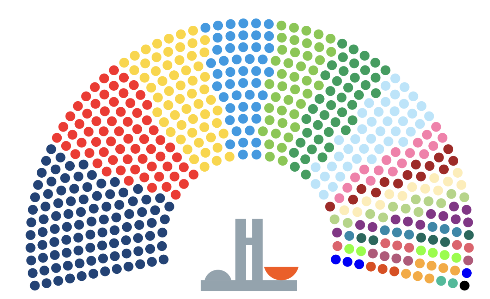
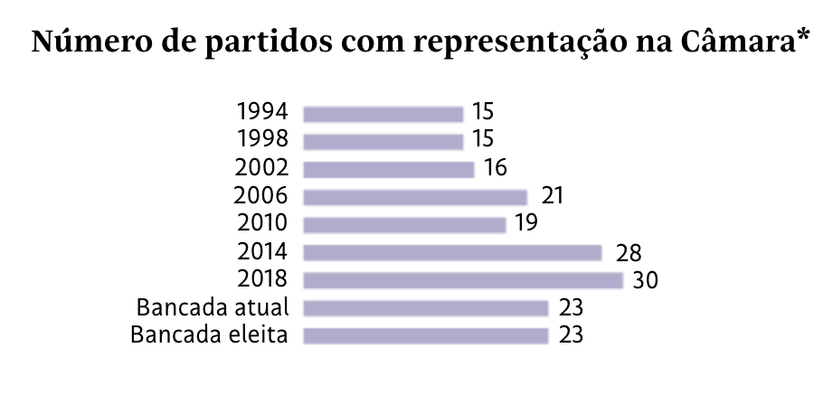
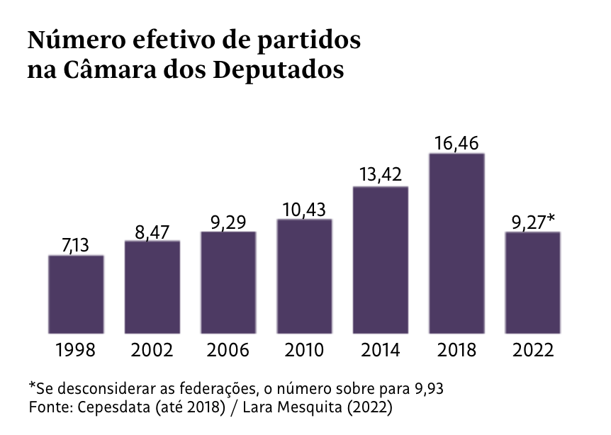
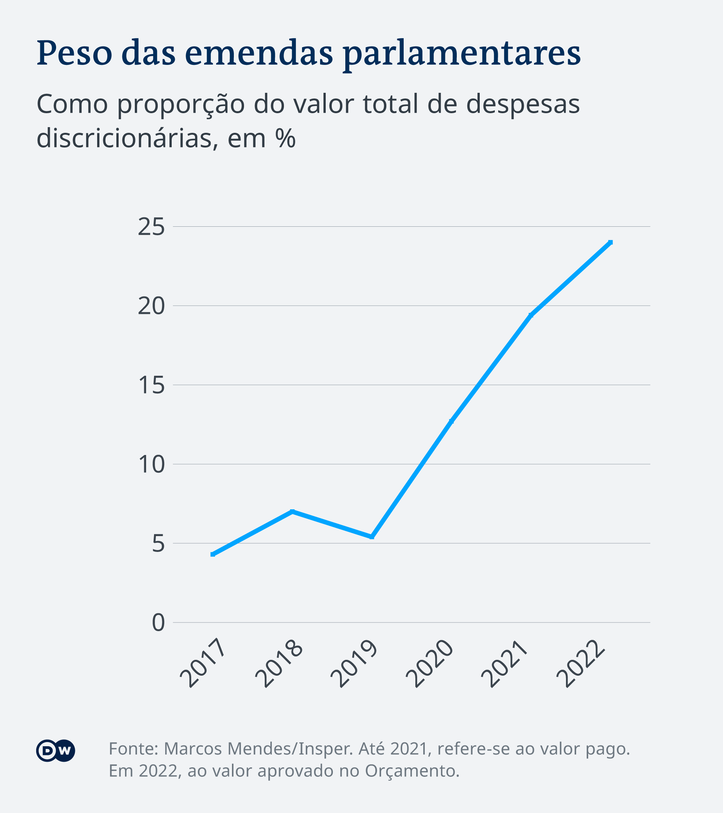
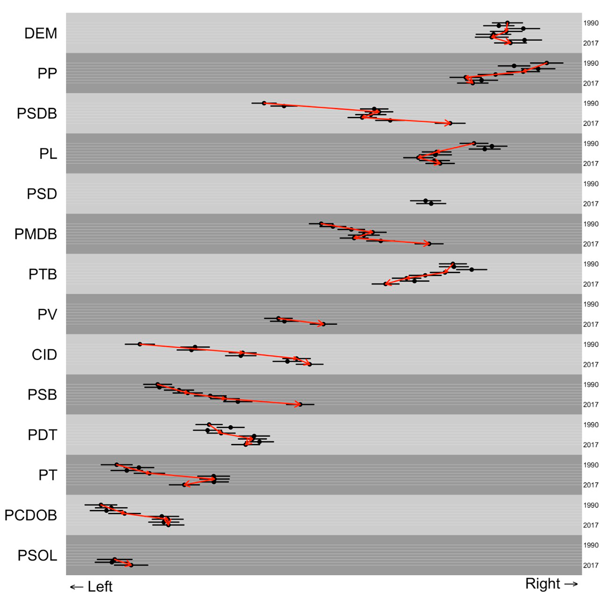
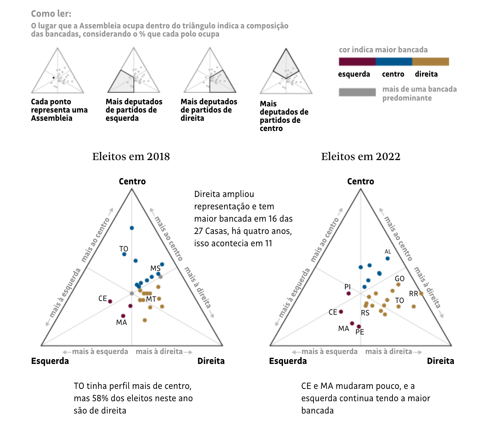
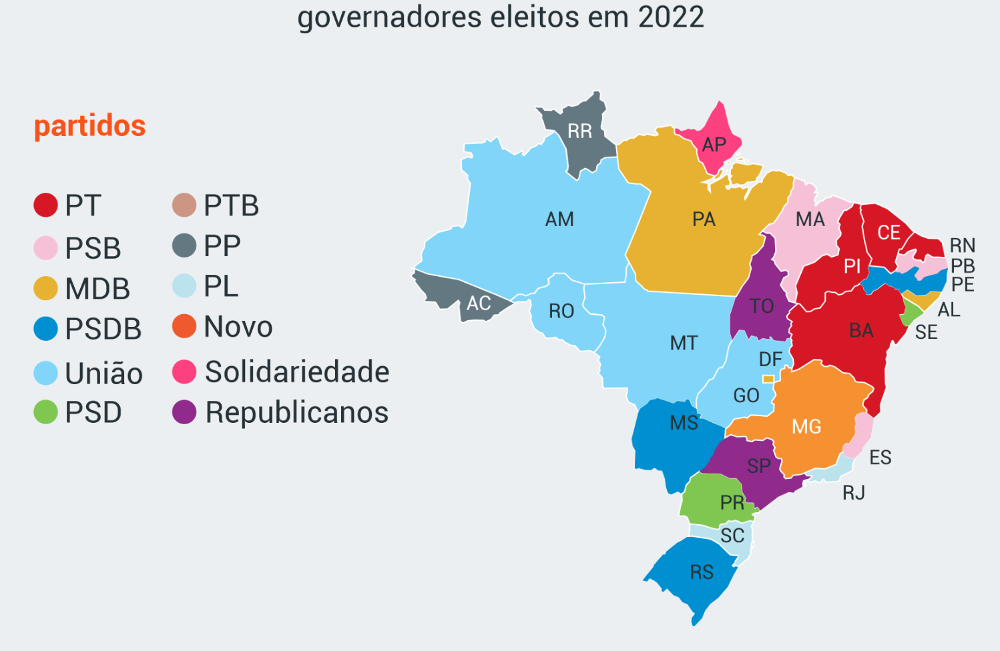
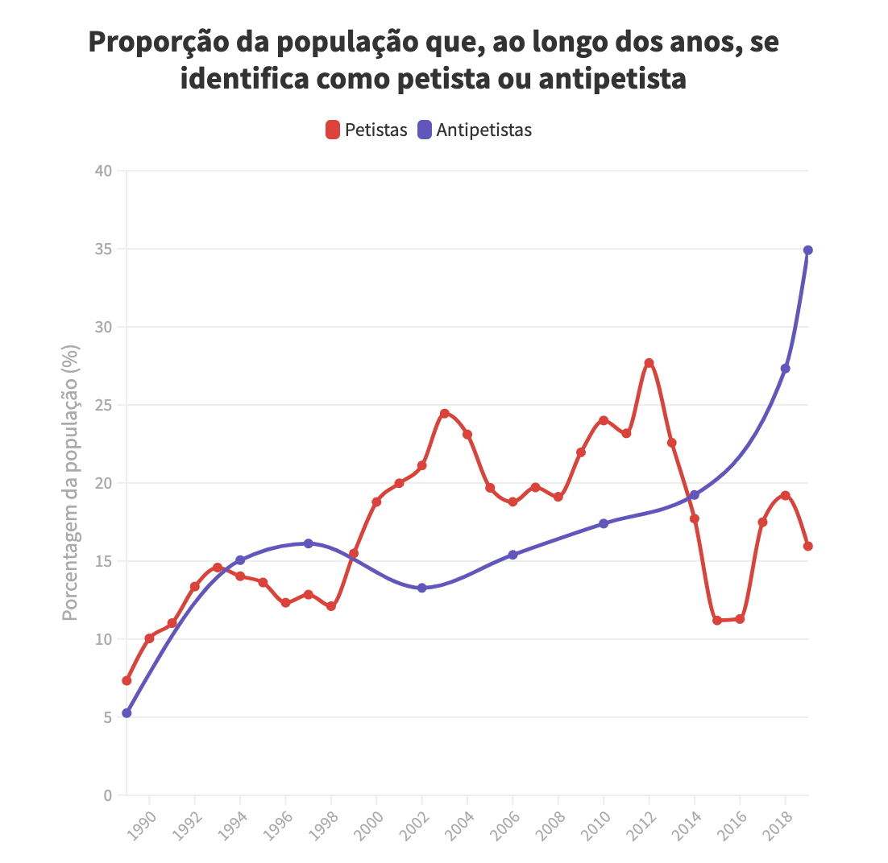
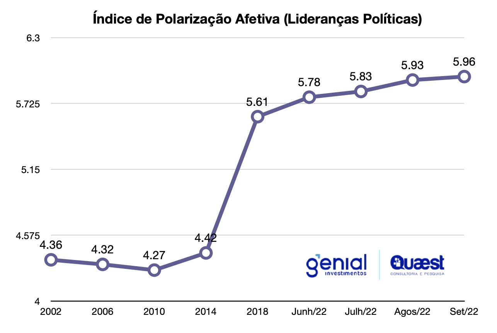

class:inverse, center, middle
background-image: url(https://imagenes.america.elpais.com/resizer/Wx27Op5j-nHaVeqNm4H1w4svizM=/1960x1103/cloudfront-eu-central-1.images.arcpublishing.com/prisa/ZBWVVWJD2VHIXHBS6KHYMHM7OI.jpg)
background-size: cover

???

Lula and Bolsonaro, likely the most polarizing figures of the last 20 years.

If you look at this from an international perspective, one concerned with boosting social development, respecting human rights, protecting the environment... this may look at first sight as a clear victory of progress. 

At the end of the day, Bolsonaro weakened accountability institutions (CGU, PF, Ministry of Justice); politicized the Military in his support; easaed access to weapons and promoted political violence (e.g. against civil society leaders and opposition figures); verbal aggressions to journalists and academics; mismanagement of health policy leading to hundreds of thousands of COVID deaths, retreat in progress in vaccinations and infant mortality; weaker monitoring of illegal extractive industries in the Amazon; economic reforms by and large did not happen; far from political reform, the Bolsonaro administration gave in to demands from the Centrão

Lula won by 1.8 points of the vote -- that's over 2M votes.

But that's the smaller margin a winning candidate has ever had in presidential elections, and a tiny margin compared with Lula's latest presidential bids (over 20 points in 2002 and 2006). What's different?

<!-- --- -->
<!-- class: inverse, center, middle -->

<!-- # Three arenas to watch: -->

<!-- ### Congress -->
<!-- ### The judiciary -->
<!-- ### Political behavior -->

<!-- ??? -->

<!-- --- -->

<!-- background-image: url(https://upload.wikimedia.org/wikipedia/commons/4/42/Congresso_Nacional_-_Bras%C3%ADlia.jpg) -->
<!-- background-size: cover -->
<!-- class: inverse, center, middle -->

<!-- # Congress -->

---


# A fragmented Congress 

.right[

]

???

Brazil uses an open-list, proportional representation system.
A very fragmented party system, without meaningful cleavages

Party with more seats is Bolsonaro's PL, with 99 -- the largest "bancada" in 25 years.

Next is PT and two allies it ran with (Communist Party and Green Party), with 68.

Next in yellow Uniao Brasil, a union of 2 previously existing parties (DEM and PSL, Bolsonaro's previous party), with 59. 

---

# A fragmented Congress 


.right[

]

???

Currently there are 23 parties represented in Congress, down from 30 in 2018.

A key term to understand Brazilian politics is coalitional presidentialism -- Presidents typically have a weak base in Congress, and they need to negotiate with a wide range of parties.

Without coalitional presidentialism, the fragmented party system, and the weakness of parties, it is hard to understand the high levels of corruption we've seen in Brasilia over the past two decades.

What's changed? New rules for an "electoral threshold" (not to access Congress, which was ruled unconstitutional, but to access federal funding and TV and radio time), and a ban on coaligações (now you can  have "federations" but they're mandated to be stable across levels and for 4 years)
---

# A fragmented Congress 

.right[

]

???

The ENPP essentially wegiths parties in Congress by the seats they have

Thanks to political reforms that penalize small parties, the ENPP has significantly decreased in the past few years.

Still, Brazil continues to have the highest ENPP in national assemblies worldwide. 

To give you an idea, the US scores at 2, France at 3, Spain at 4.6.

---

# ... with growing powers

```{r out.width = '60%', echo = FALSE}
 
```

???

Congress has been accumulating powers ever since the impeachment of Rouseff. 

Many procedural changes, but a key change is their influence over federal discretionary spending (which is only about 10% of the budget, other spending is mandated by constituion or laws)

More concessions were obtained during the Bolsonaro administration.

These include more control over the budget. Budget amendments controlled by Congress. Up until 2015 the Executive had discretion to free up the resources for individual parliamentary amendments. Then under Rouseff, in the conflict between Rouseff and Cunha (President of the House) a reform took away the Executive's discretion over these amendments. Then in 2019 another amendment made the "emendas de bancada" compulsory too.

The latest move in that direction, in 2020, is what is called the "secret budget" or "emendas de relator" -- introduced by the "relator" of the budget, amendments by Congresspeople, typically directed to municipalities where their base is, and with very little transparency on where the money goes or how it is executed. 

Supreme Court may rule that procedure unconstitutional, but the role of Congress in the budget is key nonetheless. 

---

# A party system in flux 

```{r out.width = '75%', echo = FALSE}
knitr::include_graphics("plots/parties.png") 
```

???

Reality is actually a lot more complex than this graph makes it look.

There have been many parties coming in and out of the picture, fusions, name changes, etc.

It's not just parties changing, political leaders switch parties too. Just to give you an example: President Bolsonaro changed 10 times of political party during his career, and current Leader of the House Arthur Lira 5 times

---

# ... moving to the right

```{r out.width = '65%', echo = FALSE}
 
```

???

Parties themselves have also had significant movements. Many of them lack a clear ideological base, and what structures the party system is not clear social cleavages. 

These are measures from the Brazilian Legislative Study, up to 2017.

If we had a more updated graph, we'd seen more movements and more right-ward moves.

---

# ... also at the state level

```{r out.width = '75%', echo = FALSE}
 
```

---

<!-- # Also at the state level -->

<!-- ```{r out.width = '90%', echo = FALSE} -->
<!--   -->
<!-- ``` -->


<!-- --- -->

# A polarized electorate

```{r out.width = '65%', echo = FALSE}
 
```


???

Latest figures from a 2022 survey put petismo at 24% and antipetismo at 29%. More than half of the electorate.

---

# A polarized electorate

```{r out.width = '90%', echo = FALSE}
 
```


???

This is from survey measures of feeling thermometers towards the PT leader and its main opposition figure


<!-- --- -->

<!-- background-image: url(https://upload.wikimedia.org/wikipedia/commons/1/17/Supremo_Brasil.jpg) -->
<!-- background-size: cover -->
<!-- class: inverse, center, top -->

<!-- # Judicial politics -->

---
# Take-aways

???

Lula is already adapting to this scenario. His support to Arthur Lira (in Bolsonaro's camp) as Leader of the House has to be seen under that light. We will continue to see many paradoxes that need to be understood from the weakness of Lula and the massive constraints of the political system.

Paradoxically, what is needed to make the system better is likely to make Lula's political survival less likely. 
--

The transformations in the Brazilian political system and a significantly worse macroeconomic environment will make things very hard for Lula's third term in office. What worked in the past won't work this time. 

<br>
--

If Bolsonaro lost the Presidency, his camp (a growing and increasingly solidified right) retains very significant power in Congress, at the state level, and in shaping the identities, attitudes, and behaviors of a large sector of the electorate. 

<br>
--

Lula's ability to durably change policy outcomes will depend on the Executive's relationship to Congress, the judiciary, and other accountability actors; and on its ability to curb the dynamics of polarization among both citizens and elites. 

<br>
--

.right[
```{r echo=FALSE, tidy=FALSE}
library(fontawesome)
```
`r fa('laptop')` [**www.guillermotoral.com**](https://guillermotoral.com)
 / `r fa('envelope')` [**guillermo.toral@ie.edu**](mailto:guillermo.toral@ie.edu) / `r fa('twitter')` [**@guillermo_toral**](https://twitter.com/guillermo_toral)
]


